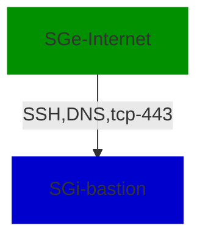
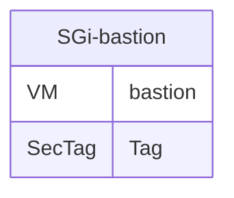
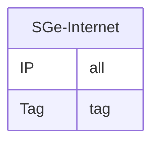

# Test 

# Firewall Rules

```mermaid
graph TD
  classDef sgi fill:#0000cc,stroke:#0000cc,stroke-width:4px;
  classDef sge fill:#009000,stroke:#009000,stroke-width:4px;


  SGe-Internet:::sge -- SSH,DNS,tcp-443 --> SGi-bastion:::sgi

```

# Definition SecurityGroups

```mermaid
%%{init: {'themeCSS': '.er.entityBox { fill: #0000cc; } .er.attributeBoxOdd { fill: #0000cc;} .er.attributeBoxEven { fill: #0000cc;} ' }}%%

erDiagram 
  SGi-bastion {
    VM bastion
    SecTag Tag
  }
  
```

# Definition IPSets

```mermaid
%%{init: {'themeCSS': '.er.entityBox { fill: #009000; } .er.attributeBoxOdd { fill: #009000;} .er.attributeBoxEven { fill: #009000;} ' }}%%

erDiagram 
  SGe-Internet {
    IP all
    Tag tag
  }
  
```