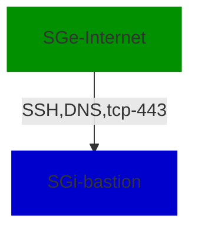
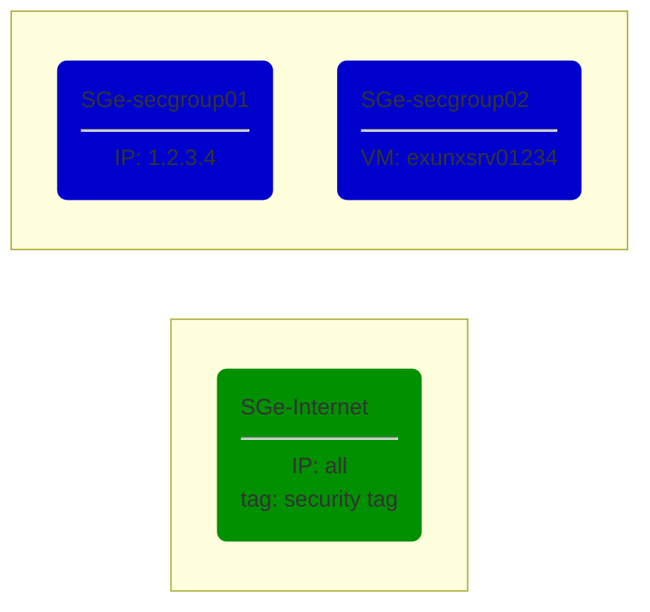
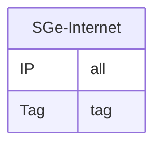

# Test 

# Firewall Rules

```mermaid
graph TD
  classDef sgi fill:#0000cc,stroke:#0000cc,stroke-width:4px;
  classDef sge fill:#009000,stroke:#009000,stroke-width:4px;


  SGe-Internet:::sge -- SSH,DNS,tcp-443 --> SGi-bastion:::sgi

```

# Definition SecurityGroups (graph)

```mermaid
graph LR;
  classDef sgi fill:#0000cc,stroke:#0000cc,stroke-width:4px,text-align:left
  classDef sge fill:#009000,stroke:#009000,stroke-width:4px,text-align:left

  subgraph " "
    SGe-Internet(SGe-Internet<hr>IP: all<br>tag: security tag):::sge
  end

  subgraph " " 
    SGi-secgroup01(SGe-secgroup01<hr>IP: 1.2.3.4):::sgi
    SGi-secgroup02(SGe-secgroup02<hr>VM: exunxsrv01234):::sgi
  end

```

# Definition SecurityGroups (erDiagram)

```mermaid
%%{init: {'themeCSS': '.er.entityBox { fill: #0000cc; } .er.attributeBoxOdd { fill: #0000cc;} .er.attributeBoxEven { fill: #0000cc;} ' }}%%

erDiagram

  SGi-bastion {
    VM bastion
    SecTag Tag
  }
  
  SGi-secgroup01 {
    VM bastion
    SecTag Tag
  }

  SGi-secgroup02 {
    VM bastion
    SecTag Tag
  }

  SGi-secgroup03 {
    VM bastion
    SecTag Tag
  }

  SGi-secgroup04 {
    VM bastion
    SecTag Tag
  }

  SGi-secgroup05 {
    VM bastion
    SecTag Tag
  }

  SGi-secgroup06 {
    VM bastion
    SecTag Tag
  }

  SGi-secgroup07 {
    VM bastion
    SecTag Tag
  }

  SGi-secgroup08 {
    VM bastion
    SecTag Tag
  }

  SGi-secgroup09 {
    VM bastion
    SecTag Tag
  }

  SGi-secgroup10 {
    VM bastion
    SecTag Tag
  }

  SGi-secgroup11 {
    VM bastion
    SecTag Tag
  }

  SGi-secgroup12 {
    VM bastion
    SecTag Tag
  }  

```

# Definition IPSets

```mermaid
%%{init: {'themeCSS': '.er.entityBox { fill: #009000; } .er.attributeBoxOdd { fill: #009000;} .er.attributeBoxEven { fill: #009000;} ' }}%%

erDiagram 
  SGe-Internet {
    IP all
    Tag tag
  }
  
```